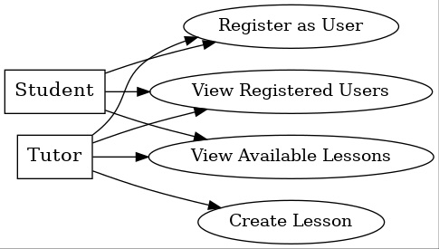
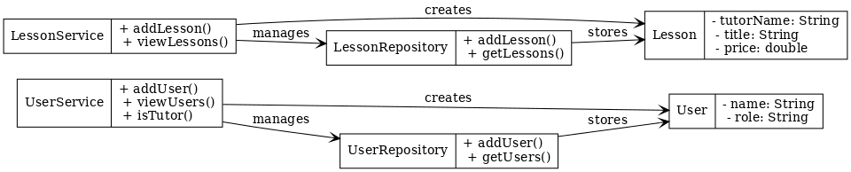
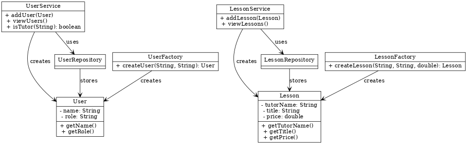
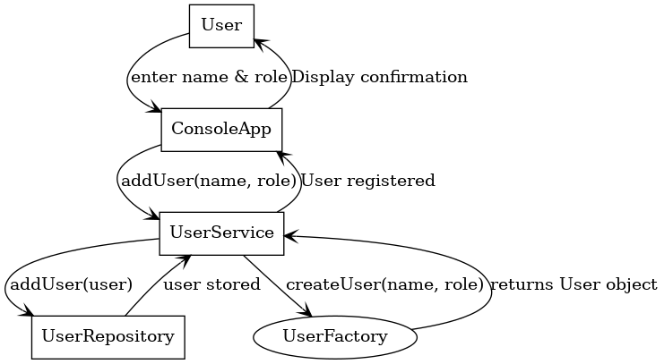
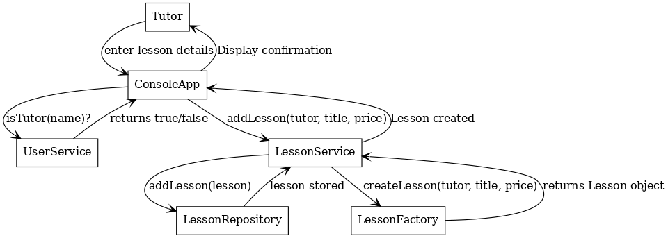

# Iteration 1 - Lesson Management System

## Scope of Iteration 1

In this first iteration, we developed a Minimal Viable Version (MVV) of the Lesson Management System. The system allows users (students & tutors) to register, tutors to create lessons, and students to view available lessons. The system is implemented as a console-based application using an in-memory repository, and follows a structured, maintainable approach with the use of key design patterns.

## Implemented Use Cases

### Register as a User (UC1)

- Both students and tutors can register.

- Users provide a name and specify their role (student/tutor).

### View Registered Users

- Displays a list of all registered users.

### Create a Lesson (Tutor Only) (UC5)

- Tutors can create lessons by specifying a title and price.

### View Available Lessons (UC11)

- Students and tutors can view all available lessons.

## UML Diagrams

To document our work, we have created the following UML diagrams:

### 1. Use Case Diagram

This diagram illustrates the interactions between students, tutors, and the system.

### 2. Domain Model Diagram

The domain model represents the key entities (User, Lesson) and their relationships.

### 3. Class Diagram (DCD - Design Class Diagram)

The class diagram illustrates the structure and relationships between different classes in our system.

### 4. Sequence Diagram - Registering a User

This diagram shows the step-by-step interaction when a user registers in the system.

### 5. Sequence Diagram - Creating a Lesson

This diagram represents the interactions when a tutor creates a lesson.

## Applied Design Patterns

To ensure a scalable and maintainable architecture, we applied the following design patterns:

### 1. Singleton Pattern

Applied to UserRepository and LessonRepository to ensure only one instance of each repository exists.

This prevents data inconsistency and reduces memory usage.

### 2. Factory Pattern

UserFactory and LessonFactory were introduced to centralize object creation.

This encapsulates object instantiation, making the system easier to modify and extend.

### 3. Repository Pattern

UserRepository and LessonRepository abstract away data storage, following the separation of concerns principle.

This allows us to easily replace the in-memory storage with a database in future iterations.
