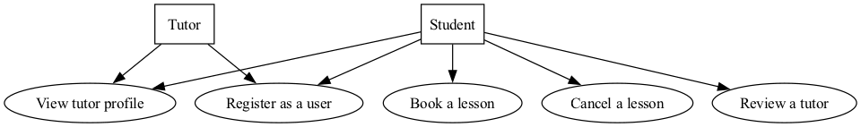
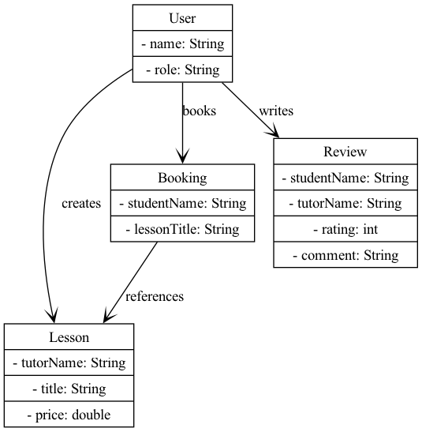
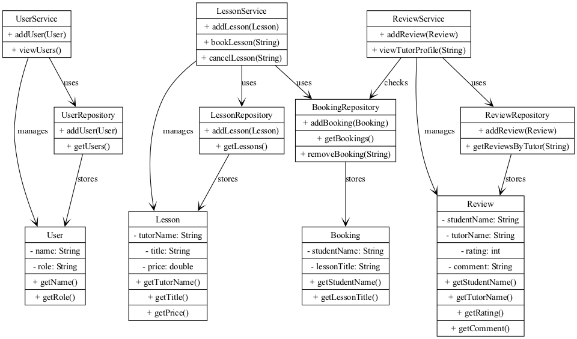
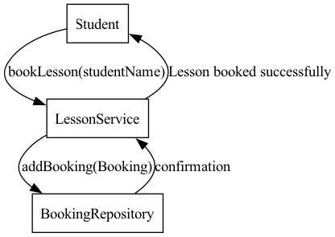
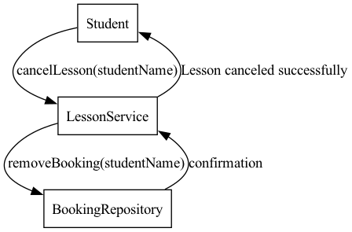
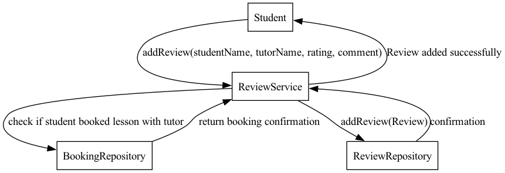

# Iteration 2 - Lesson Management System

## Scope of Iteration 2

Building on the foundation from Iteration 1, this iteration expands the system by implementing additional use cases while keeping it console-based and in-memory.

## New Use Cases Implemented

### UC2: A Student Books a Lesson

- A student can book a lesson from the available list.

- Bookings are stored in memory.

- A lesson cannot be double-booked (one student per lesson).

### UC6: A Tutor or Student Cancels a Lesson

- Students can cancel booked lessons.

- Tutors can remove lessons they created.

- The system updates the repository accordingly.

### UC8: A Student Can Review Tutors After a Lesson

- Students can leave reviews for tutors they have had lessons with.

- The system stores ratings and comments in memory.

### UC9: A Student Can Obtain Information About a Tutor

- Students can view a tutor’s profile, including:

- Reviews and ratings from other students.

## UML Diagrams

This iteration introduces additional UML diagrams to reflect the new functionality.

### 1. Updated Use Case Diagram

### 2. Updated Domain Model Diagram

### 3. Updated Class Diagram (DCD - Design Class Diagram)

### 4. Sequence Diagram - Booking a lesson

### 5. Sequence Diagram - Cancelling a lesson

### 6. Sequence Diagram - Reviewing a Tutor

## Applied Design Patterns

We continue using best software practices to ensure scalability and maintainability.

### 1. Singleton Pattern

Ensures that UserRepository, LessonRepository, and ReviewRepository each have only one instance.

### 2. Factory Pattern

UserFactory, LessonFactory, and ReviewFactory centralize object creation.

### 3. Repository Pattern

UserRepository, LessonRepository, and ReviewRepository store data in-memory, preparing for a potential database integration in future iterations.
