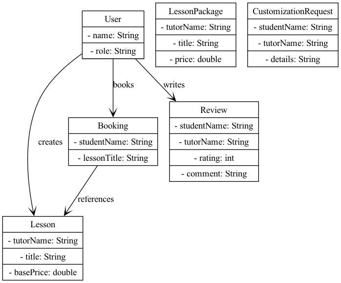
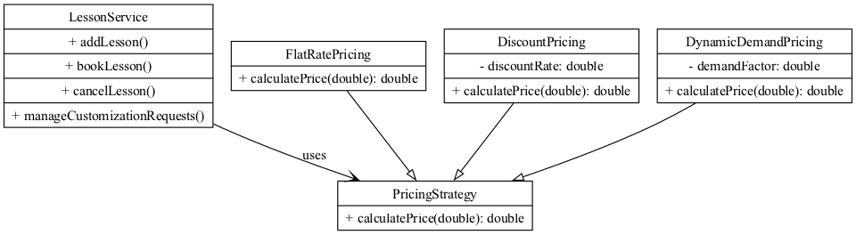

# Iteration 3 - Lesson Management System

## Scope of Iteration 3

In Iteration 3, we aim to enhance functionality by implementing new use cases and improving existing features where necessary. The focus will be on expanding the system's capabilities while maintaining a clean, maintainable, and modular design.

## New Use Cases Implemented

### UC3: A Tutor Can Manage Lesson Packages

- Tutors can create, edit, and remove lesson packages.

- Lesson packages include multiple sessions that students can enroll in.

- Tutors can set package pricing and availability.

### UC4: A Student Sends a Lesson Customization Request

- Students can request custom lesson modifications (e.g., duration, topics, or scheduling changes).

- Tutors receive and can approve or reject these requests.

- The system tracks modification history.

### UC7: A Student Views the Lesson Calendar

- Students can see their upcoming and past booked lessons in a calendar view.

- The system provides a structured view of lesson schedules.

- Tutors can view their scheduled lessons as well.

### UC10: A User Can Choose a Study Field to Get a List of All Relevant Tutors

- Students can filter available tutors by study field (e.g., Mathematics, Computer Science, Languages).

- The system provides a list of tutors specializing in the chosen field.

- Improves user experience by guiding students to the most relevant instructors.

### UC11: A Student Can View the Different Lessons Available for the Specific Tutor

- When viewing a tutor’s profile, students can see all the lessons that tutor offers.

- Lessons are displayed with details such as price, duration, and available slots.

- Enhances navigation and decision-making for students.

## UML Diagrams

This iteration introduces additional UML diagrams to reflect the new functionality.

### 1. Updated Use Case Diagram

### 2. Updated Domain Model Diagram

### 3. Updated Class Diagram (DCD - Design Class Diagram)

### 4. Sequence Diagram - Managing Lesson Packages

### 5. Sequence Diagram - Sending a Lesson Customization Request

### 6. Sequence Diagram - Viewing the Lesson Calendar

## Applied Design Patterns

We continue using best software practices to ensure scalability and maintainability.

### 1. Singleton Pattern

- Ensures that UserRepository, LessonRepository, and ReviewRepository each have only one instance.

### 2. Factory Pattern

- UserFactory, LessonFactory, and ReviewFactory centralize object creation.

### 3. Repository Pattern

- UserRepository, LessonRepository, and ReviewRepository store data in-memory, preparing for a potential database integration in future iterations.

### 4. Observer Pattern (New)

- Implemented for lesson modification requests, notifying tutors when a student requests changes.

### 5. Strategy Pattern (New)

- Used for different lesson pricing strategies (e.g., single-session pricing vs. package pricing).
