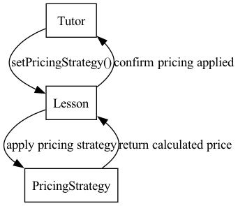

[---------------nav---------------](../nav.md)

# Iteration 3 - Lesson Management System

## Scope of Iteration 3

In Iteration 3, we expanded the system's functionality by implementing new use cases, improving existing features, and introducing new design patterns to optimize modularity and maintainability. The primary focus was on enhancing tutor and student interactions, improving lesson pricing mechanisms, and streamlining notification handling.

**All Use Cases are now fully functional**, providing a comprehensive lesson management system.

## New Use Cases Implemented

### UC3: A Tutor Can Manage Lesson Packages

- Tutors can create, view, and delete lesson packages.
- Lesson packages contain multiple sessions at a fixed price.
- Students can purchase predefined lesson packages from tutors.

### UC4: A Student Sends a Lesson Customization Request

- Students can request custom lesson modifications (e.g., duration, topics, scheduling changes).
- Tutors can view, approve, or reject these requests.
- The system tracks modification history.
- **New Feature:** Tutors now receive notifications when a student submits a customization request.

### UC7: A Student Views the Lesson Calendar

- Students can view their booked lessons in a structured calendar format.
- Tutors can view their scheduled lessons as well.
- Provides a clearer overview of lesson schedules.

### UC10: A User Can Choose a Study Field to Get a List of All Relevant Tutors

- Students can filter available tutors by study field (e.g., Mathematics, Computer Science, Languages).
- Tutors can have multiple study fields assigned.
- Enhances navigation and improves student decision-making.

### UC11: A Student Can View the Different Lessons Available for the Specific Tutor

- Students can view all lessons a specific tutor offers.
- Lessons display details such as price, duration, and availability.
- Ensures that students can make informed booking decisions.

## Additional Enhancements

### **Lesson Pricing Mechanism (New Feature)**

- Tutors can now select different pricing strategies for their lessons.
- Three pricing strategies were implemented:
  - **Flat Rate Pricing** (Static price per lesson)
  - **Discount Pricing** (Percentage-based discount on lessons)
  - **Dynamic Demand Pricing** (Price increases based on demand factor)
- Ensures flexible pricing structures based on tutor preferences.

### **Tutor Notification System (New Feature)**

- Tutors now receive notifications when a student submits a lesson customization request.
- Notifications are stored in a repository and can be viewed from the tutor menu.
- Tutors can mark notifications as read after reviewing them.

## UML Diagrams

This iteration introduces additional UML diagrams to reflect the new functionality.

### 1. Updated Use Case Diagram

### 2. Updated Domain Model Diagram

### 3. Updated Class Diagram (DCD - Design Class Diagram)

### 4. Sequence Diagram - Managing Lesson Packages

### 5. Sequence Diagram - Sending a Lesson Customization Request

### 6. Sequence Diagram - Viewing the Lesson Calendar

### 7. Sequence Diagram - Purchasing a Lesson Package

### 8. Sequence Diagram - Applying Pricing Strategy to Lessons

## Applied Design Patterns

We continue using best software practices to ensure scalability and maintainability.

### 1. Singleton Pattern

- Ensures that UserRepository, LessonRepository, BookingRepository, NotificationRepository, and ReviewRepository each have only one instance.

### 2. Factory Pattern

- UserFactory, LessonFactory, and LessonPackageFactory centralize object creation.

### 3. Repository Pattern

- UserRepository, LessonRepository, BookingRepository, NotificationRepository, and ReviewRepository store data in-memory, preparing for potential database integration in future iterations.

### 4. Observer Pattern _(New)_

- Implemented for lesson modification requests, notifying tutors when a student requests changes.
- `TutorNotificationService` listens for new customization requests and stores notifications for tutors to review.

### 5. Strategy Pattern _(New)_

- Used for different lesson pricing strategies (e.g., single-session pricing vs. package pricing).
- Allows tutors to select a pricing strategy when creating lessons.
- The price dynamically updates based on the selected strategy.
